# Windows Server Active Directory Infrastructure Lab


> Project by Samuel Kim. All rights reserved. See [LICENSE](LICENSE).

## Overview

This project documents a complete Windows Server domain environment built around identity, network services, remote administration, file services, and endpoint policy enforcement. The lab follows the same order an administrator would use in a real deployment: plan the topology, build the domain, add redundancy, configure network services, validate client access, and then apply security controls.

The main goal is to demonstrate how core Microsoft infrastructure components work together. Active Directory provides centralized identity, DNS allows domain and external name resolution, DHCP automates client addressing, RRAS provides lab routing/NAT, and Group Policy enforces workstation security settings. File services, roaming profiles, quotas, and software deployment are included to show how a domain environment supports daily user operations.

From a cybersecurity perspective, the lab focuses on the controls that matter most in a small Windows domain: reducing default-account exposure, using named administrative access, separating users into groups, validating least privilege on file shares, controlling endpoint behavior through GPO, and checking that the environment behaves as expected after each change.

## Objectives

- Build a Windows domain with two domain controllers.
- Promote DC1 into a new Active Directory forest and add DC2 as an additional domain controller.
- Configure AD users, groups, OUs, FSMO role management, and scripted account creation.
- Implement RRAS NAT/PAT routing for outbound lab connectivity.
- Deploy DHCP scopes, exclusions, lease duration, gateway/DNS options, and DHCP failover.
- Configure DNS forwarding, primary/secondary zones, stub zones, host records, and round robin validation.
- Enable remote administration through RDP for approved administrator groups.
- Configure roaming and mandatory profiles.
- Implement file-server shares, NTFS permissions, mapped drives, quotas, and file screening.
- Harden Windows clients with Group Policy controls.
- Configure password policy controls and document the correct enterprise approach for department-specific policies.

## Project Roadmap

| Section | What I configured |
|---------|-------------------|
| Lab planning | Topology, server roles, addressing, and VMware inventory |
| Identity services | AD forest creation, two domain controllers, users, groups, FSMO role handling, and replication checks |
| Network services | RRAS NAT, DHCP scope options, DHCP failover, DNS forwarding, zones, and round robin records |
| Remote access | RDP access for approved administrators and lab-only NAT forwarding validation |
| User environment | Roaming profiles, mandatory profiles, home folders, and mapped drives |
| File access | Share permissions, NTFS access, FSRM quotas, and file screening |
| Endpoint policy | GPO hardening, removable storage controls, local administrator assignment, and software deployment |
| Account security | Password policy controls and production-correct notes for group-specific password policy |

## Lab Environment

The environment is intentionally small but covers the main moving parts of a Windows domain. DC1 hosts the initial domain services, DC2 provides additional domain-controller and file-server functionality, SAMNAT acts as the lab router, and the Windows 10 client is used to validate user-facing behavior.

| Component | Description |
|----------|-------------|
| Domain | `samueldomain.com` |
| DC1 | Windows Server 2019, AD DS, DNS, DHCP |
| DC2 | Windows Server 2019, additional domain controller, DNS, file server |
| SAMNAT | Windows Server 2019, RRAS NAT router |
| Client | Windows 10 domain-joined workstation |
| Internal network | `192.168.116.0/24` |
| DC1 IP | `192.168.116.200` |
| DC2 IP | `192.168.116.201` |
| NAT/LAN gateway | `192.168.116.254` |
| WAN network | `192.168.68.0/24` lab bridged network |

> The lab screenshots intentionally retain the original lab usernames, domain names, and passwords because they are part of the submitted lab evidence.

## Tools and Technologies

- Microsoft Windows Server 2019
- Microsoft Windows 10
- VMware virtual machines
- Active Directory Domain Services
- DNS Server
- DHCP Server
- Routing and Remote Access Service
- Group Policy Management
- Active Directory Users and Computers
- File Server Resource Manager
- PowerShell Active Directory module
- `dsadd`
- `net use`
- RDP
- NTFS ACLs

## Implementation Walkthrough

The walkthrough is ordered by dependency. Domain services are configured first, then routing and address assignment, then DNS, user profile behavior, file services, and finally endpoint/security policy. Each step explains the purpose of the configuration before showing the supporting evidence.

---------

## Network Topology and Lab Planning

The lab starts with a defined topology and addressing plan. This stage matters because Windows domain services depend heavily on predictable DNS, stable domain-controller addresses, and clear server roles. A weak plan at this point can cause problems later with domain joins, DHCP options, replication, and name resolution.

The design uses two domain controllers for identity services, SAMNAT for network routing/NAT, and one Windows 10 endpoint to test the user experience from a client perspective.

**Implemented controls:**

- Defined the logical topology and traffic path.
- Documented server roles before installation.
- Planned static IP addressing for infrastructure systems.
- Prepared the VMware virtual machines required for the lab.

### Network topology

This diagram shows the relationship between DC1, DC2, SAMNAT, the internal LAN, the Windows 10 client, and the external internet path. It is the baseline architecture used throughout the project.

> A topology diagram makes the lab easier to understand before any configuration starts. It shows which machines provide identity services, which server routes traffic, where clients sit, and how traffic is expected to move between the internal domain and the outside network.

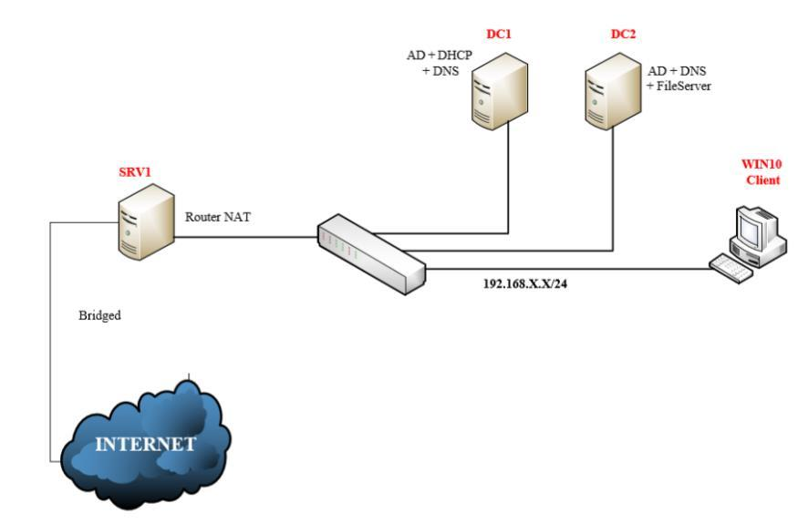

<p><sub><strong>Screenshot:</strong> Network topology with DC1, DC2, NAT server, Win10 client, LAN and internet path.</sub></p>

### Lab addressing and role plan

Before installation, the lab defines hostnames, IP addresses, gateway settings, DNS settings, and server roles. This prevents later conflicts and makes the implementation easier to validate. The table below converts the original planning screenshot into a cleaner technical reference.

> Domain controllers, DNS servers, DHCP scopes, and routing depend on stable addressing. If a domain controller IP changes unexpectedly, clients may fail to locate the domain, join the domain, apply Group Policy, or resolve internal names correctly.

**General lab parameters:**

| Item | Value |
|------|-------|
| Domain | `samueldomain.com` |
| FQDN | `samueldomain.com` |
| Internal IP range | `192.168.116.50-100/24` |
| Admin username | `Avocado` |
| Admin password | `1234qweR` |
| Planned client/user count | 17 |
| Planned client computers | 23 |
| Planned departments | 20 |

**Server addressing and roles:**

| Server Role | Hostname | Operating System | IP Address | Default Gateway | Primary DNS | Secondary DNS | Roles |
|-------------|----------|------------------|------------|-----------------|-------------|---------------|-------|
| First domain controller | `samdc1` | Microsoft Server 2019 | `192.168.116.200/24` | `192.168.116.254` | `192.168.116.200` | `192.168.116.201` | DC, DNS, AD, DHCP |
| Second domain controller | `samdc2` | Microsoft Server 2019 | `192.168.116.201/24` | `192.168.116.254` | `192.168.116.200` | `192.168.116.201` | AD, DNS, File Server |
| NAT server | `samnat` | Microsoft Server 2019 | `192.168.116.254/24` | Not configured on LAN side | `192.168.116.200` | `192.168.116.201` | Router, NAT |

### Virtual machine inventory

The VMware inventory confirms that the required machines were prepared before domain deployment: DC1, DC2, SAMNAT, and the Windows 10 client.

> The inventory proves that the lab has the correct systems before services are installed. Separating roles across different virtual machines also makes the design closer to a real environment than installing every service on one server.

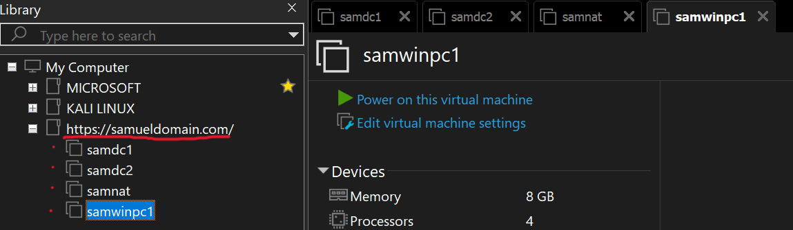

<p><sub><strong>Screenshot:</strong> VMware inventory showing the lab virtual machines.</sub></p>

### Windows Server installation media

Windows Server 2019 was selected as the server operating system for the domain controllers and the NAT server.

> Using the same server version keeps the lab consistent and reduces troubleshooting noise. Windows Server 2019 supports the AD DS, DNS, DHCP, RRAS, File Server, and Group Policy features required later in the project.

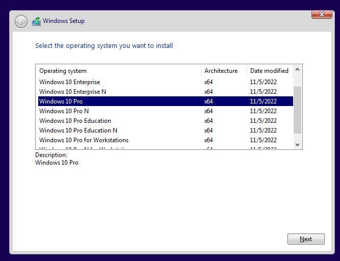

<p><sub><strong>Screenshot:</strong> Windows Server 2019 installation media selected during setup.</sub></p>

---------

## Active Directory Domain Services

Active Directory is the foundation of the lab. DC1 is prepared first because it becomes the first domain controller in the forest and establishes the domain naming structure. Once the domain exists, DC2 is joined and promoted as an additional domain controller to demonstrate redundancy, replication, and role distribution.

This section also includes account hardening and administrative group preparation because those decisions affect how the rest of the environment is managed.

**Implemented controls:**

- Promoted DC1 into a new Active Directory forest.
- Added DC2 as an additional domain controller.
- Created a controlled administrator account and documented built-in Administrator hardening.
- Created administrative and departmental groups.
- Demonstrated user creation with DSADD and PowerShell.
- Validated AD object replication between domain controllers.

### Rename DC1 before promotion

The first server is renamed before domain promotion. Clear server naming is important because the hostname becomes part of the domain infrastructure and appears in DNS, ADUC, and management tools.

> A domain controller name becomes part of many administrative views and records. Renaming the server before promotion is cleaner than renaming it after it already holds domain-controller services, DNS records, and replication metadata.

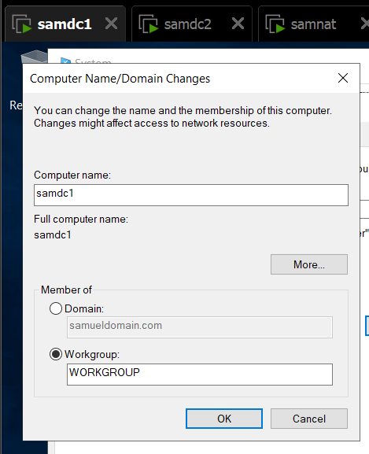

<p><sub><strong>Screenshot:</strong> DC1 computer rename before domain promotion.</sub></p>

### Add Active Directory Domain Services

The AD DS and DNS roles are selected from Server Manager. DNS is installed with AD DS because the domain depends on DNS for locating domain controllers and services.

> Active Directory Domain Services is the Windows role that provides centralized authentication, users, groups, computers, and domain policy. DNS is installed alongside it because domain clients use DNS records to find domain controllers and logon services.

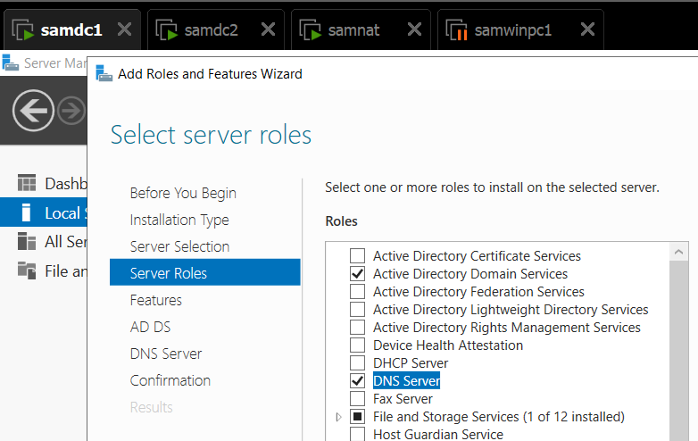

<p><sub><strong>Screenshot:</strong> Adding Active Directory Domain Services and DNS roles.</sub></p>

### Create the new forest

DC1 is promoted into a new forest using `samueldomain.com` as the root domain. This creates the directory structure, domain naming context, and initial domain services.

> A forest is the top-level security and directory boundary in Active Directory. Creating the first forest and root domain turns the server from a standalone machine into the first authority for identity, authentication, and policy in the lab.

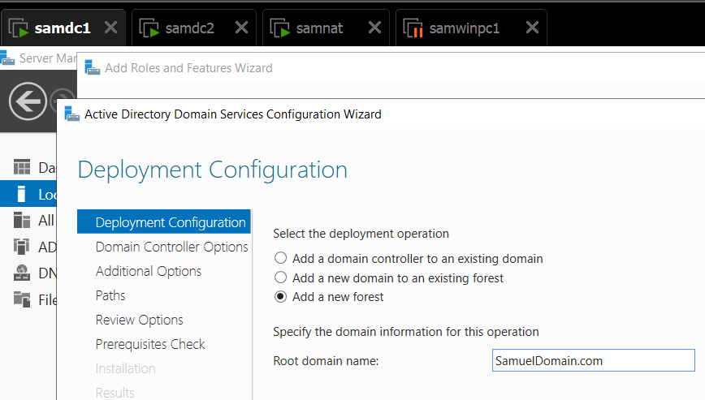

<p><sub><strong>Screenshot:</strong> New forest deployment with `samueldomain.com` as the root domain.</sub></p>

### Controlled admin account and built-in account hardening

After domain creation, a controlled administrative account is created and used instead of relying on the default built-in Administrator account. At this stage, the built-in Administrator account is also disabled as part of the hardening process.

This is a security-focused change, not just an administrative preference. The built-in Administrator account has the well-known RID 500, which makes it predictable during RID enumeration and account discovery. Attackers often look for default privileged accounts first, so using a named controlled admin account and disabling or renaming the default account reduces exposure to default-user targeting while keeping administrative access available.

> Administrative work should be tied to controlled, named accounts instead of a default account that every attacker expects to exist. This also makes auditing cleaner because privileged actions can be connected to a specific administrative identity.

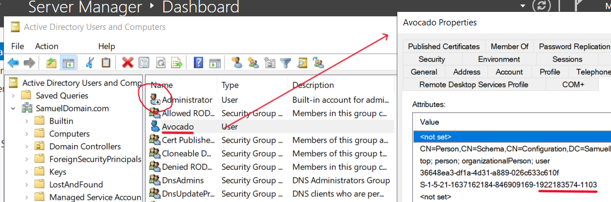

<p><sub><strong>Screenshot:</strong> Controlled administrative account created before hardening the default built-in Administrator account.</sub></p>

> Security note: In a production environment, this control should be combined with least privilege, privileged access management, MFA for administrative access, and auditing of privileged logons.

### Promote DC2 into the existing domain

DC2 is joined to the existing domain and promoted as an additional domain controller. This improves resilience and provides another server for domain services.

> A second domain controller gives the domain another copy of the directory database and another server that can answer logon and directory requests. This reduces dependence on DC1 and demonstrates the idea of redundancy in identity infrastructure.

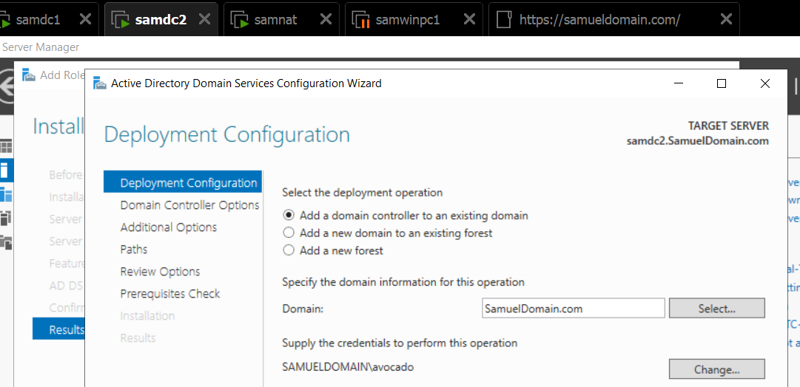

<p><sub><strong>Screenshot:</strong> DC2 promotion into the existing domain.</sub></p>

### Transfer the RID Master role

The RID Master FSMO role is transferred to DC2 as part of the domain-controller administration exercise. The RID Master allocates relative IDs used to create unique SIDs for new AD objects.

> FSMO means Flexible Single Master Operations. These are special Active Directory roles that must be handled by one domain controller at a time to avoid conflicts. The RID Master gives domain controllers pools of Relative IDs, and those RIDs become part of each user, group, or computer SID. Without available RID pools, the domain can run into problems creating new security principals.

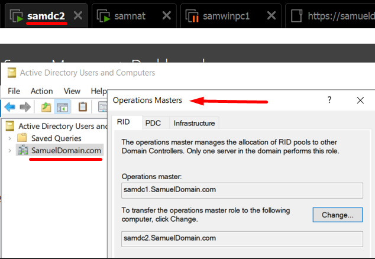

<p><sub><strong>Screenshot:</strong> RID Master role transfer confirmation.</sub></p>

### Create administrative and department groups

The lab creates groups such as `Sales` and `Sys_Admins`. These groups are later used for file permissions, remote management, and Group Policy targeting.

> Groups are the clean way to manage access. Instead of assigning permissions one user at a time, users are placed into groups and permissions are assigned to the group, which is easier to audit and maintain.

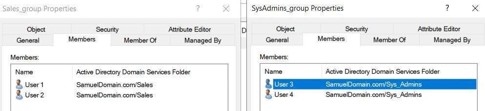

<p><sub><strong>Screenshot:</strong> Sales and Sys_Admins group membership.</sub></p>

### Create users and groups with DSADD

The project demonstrates legacy command-line administration by creating users and groups with `dsadd`. This validates that AD object creation can be automated outside the GUI.

> `dsadd` is an older command-line tool, but it shows the principle of repeatable administration. Creating objects from commands reduces manual clicks and helps keep user and group creation consistent.

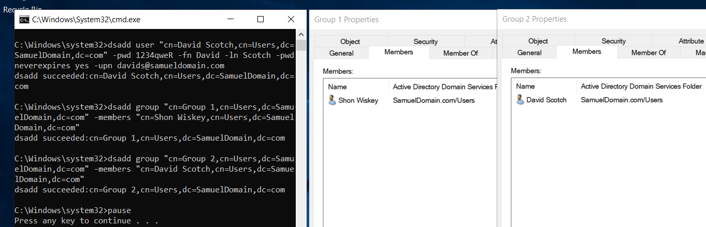

<p><sub><strong>Screenshot:</strong> DSADD script execution and created groups/users.</sub></p>

### Create users with PowerShell

PowerShell is used to create AD objects in a more modern and maintainable way. The original source used `for ($i = 50; $i -le 60; $i++)`, which creates 11 users. For exactly 10 users, the corrected loop is:

> PowerShell is the preferred approach for modern Windows administration because it is scriptable, readable, and reusable. In a real environment, bulk user creation should be automated to reduce mistakes in usernames, OU placement, passwords, and group membership.

```powershell
for ($i = 50; $i -lt 60; $i++) {
    $username = "user$i"
    New-ADUser `
        -SamAccountName $username `
        -UserPrincipalName "$username@samueldomain.com" `
        -Name $username `
        -Path "OU=PS,DC=SamuelDomain,DC=com" `
        -AccountPassword (ConvertTo-SecureString "1234qweR" -AsPlainText -Force) `
        -Enabled $true
}
```

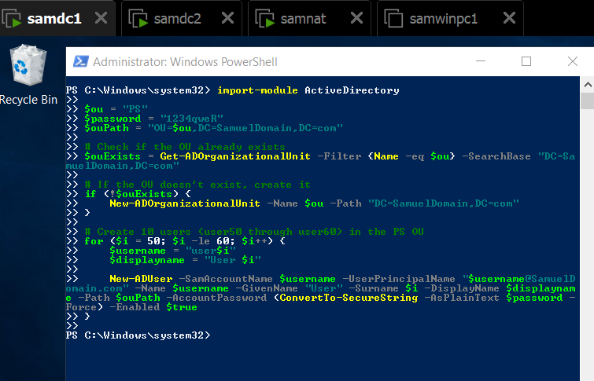

<p><sub><strong>Screenshot:</strong> PowerShell loop used for bulk AD user creation.</sub></p>

### Validate AD replication

The created objects are visible across the domain controllers. This confirms that AD changes are replicating between DC1 and DC2.

> Replication is what keeps domain controllers synchronized. If users or groups appear on one domain controller but not another, clients may receive inconsistent authentication or policy results depending on which domain controller they contact.

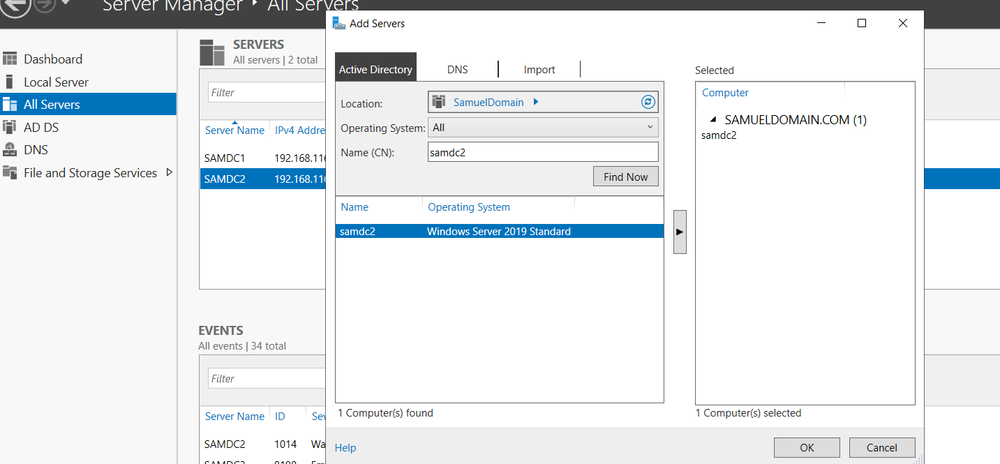

<p><sub><strong>Screenshot:</strong> AD object synchronization visible on both domain controllers.</sub></p>

---------

## NAT and Routing with RRAS

SAMNAT is configured with an internal LAN interface and an external bridged interface. RRAS provides NAT so internal lab systems can reach external networks without assigning each internal host direct external access.

PAT is documented here as a NAT translation method, not a standalone protocol. It allows multiple internal systems to share one external address by translating sessions with unique port mappings.

The purpose of this section is to make the isolated lab network usable for validation tasks such as DNS forwarding tests, updates, and external connectivity checks while keeping the internal subnet controlled.

**Implemented controls:**

- Configured separate LAN and WAN interfaces on SAMNAT.
- Installed the Remote Access role for RRAS.
- Enabled NAT and LAN routing.
- Marked the WAN adapter as the public NAT interface.
- Validated outbound connectivity from internal systems.

### Configure SAMNAT network interfaces

SAMNAT has a LAN interface for the internal `192.168.116.0/24` network and a WAN interface connected to the bridged external network.

> A NAT router needs at least two sides: an inside network and an outside network. The LAN adapter faces the private domain network, while the WAN adapter provides the path toward the external network.

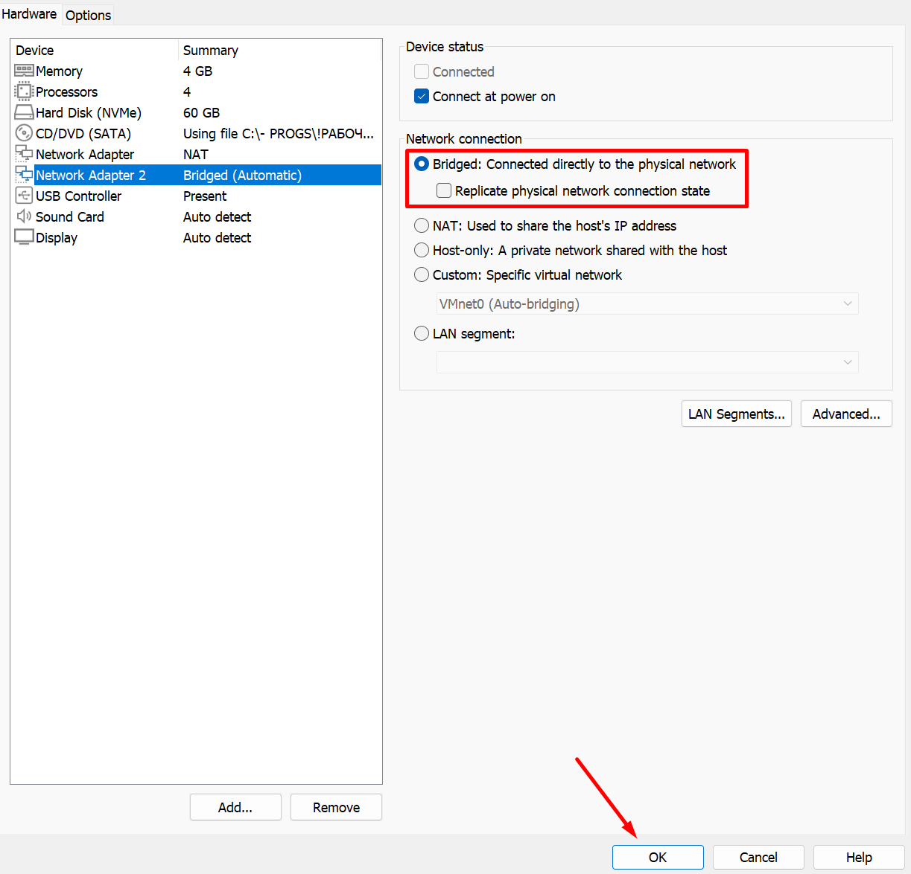

<p><sub><strong>Screenshot:</strong> SAMNAT domain membership and network interface setup.</sub></p>

### Install the Remote Access role

The Remote Access role is installed to provide Routing and Remote Access Service functionality.

> RRAS is the Windows Server feature that can provide routing, NAT, and remote access capabilities. In this lab it is used as a router/NAT service so internal machines do not need direct external network exposure.

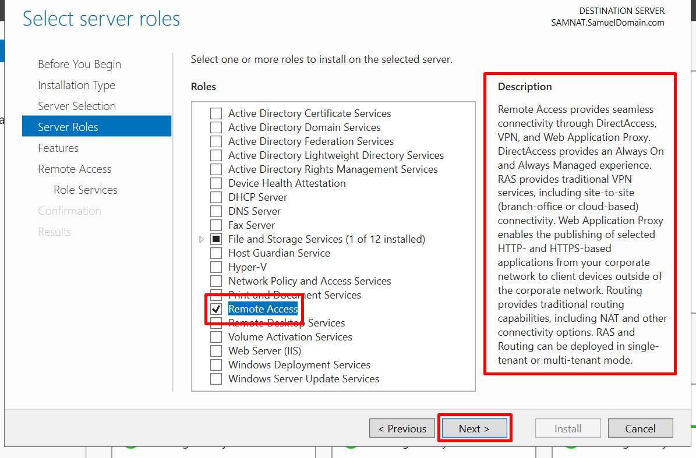

<p><sub><strong>Screenshot:</strong> Remote Access role selected for NAT/RRAS.</sub></p>

### Enable NAT and LAN routing

RRAS is configured with NAT and LAN routing. This allows internal hosts to send traffic through SAMNAT.

> NAT translates private internal addresses into an address that can communicate externally. PAT, often called NAT overload, also tracks sessions by port number so multiple internal machines can share the same outside path at the same time.

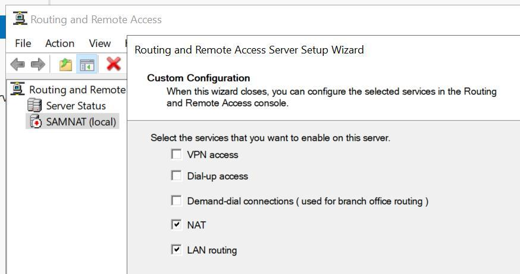

<p><sub><strong>Screenshot:</strong> RRAS custom configuration with NAT and LAN routing.</sub></p>

### Mark the WAN interface as public

The WAN interface is selected as the public interface connected to the external network. NAT is enabled on this interface.

> RRAS must know which adapter is internal and which one is external. Marking the wrong adapter as public can break routing or accidentally expose the wrong side of the network.

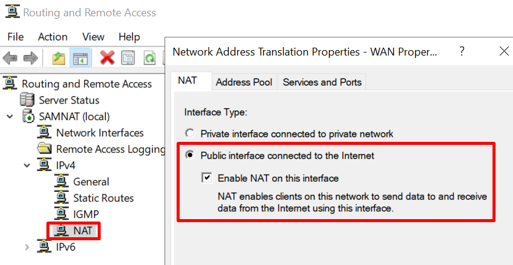

<p><sub><strong>Screenshot:</strong> NAT public interface configuration.</sub></p>

### Validate internet connectivity from DC1

After NAT is configured, DC1 can reach an external DNS address. This proves that internal systems can route outbound traffic through SAMNAT.

> A connectivity test confirms that the design works end to end: DC1 sends traffic to its gateway, SAMNAT translates and routes it, and the response returns correctly. This validation is needed before later DNS forwarding and update-related tests.

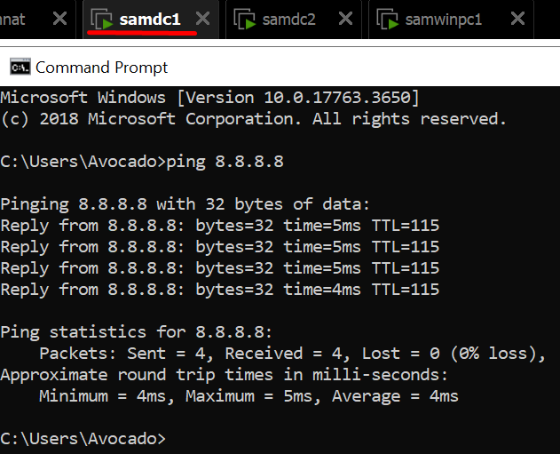

<p><sub><strong>Screenshot:</strong> DC1 ping test to public DNS through NAT.</sub></p>

---------

## DHCP Services and Failover

DHCP is installed on DC1 to automatically provide IP configuration to client systems. Instead of manually configuring every workstation, DHCP distributes the address, subnet mask, gateway, DNS servers, and lease information from a central service.

The lab also configures a DHCP failover relationship with DC2. This demonstrates service continuity: if one DHCP server is unavailable, the partner server can continue supporting client address assignment.

From a security and operations point of view, DHCP has to be predictable. Wrong gateway or DNS options can break authentication, redirect traffic, or make clients use the wrong name-resolution path, so the scope, exclusions, and authorization are treated as controls rather than simple setup steps.

**Implemented controls:**

- Installed and authorized the DHCP Server role.
- Created a controlled DHCP scope for client addressing.
- Configured exclusions for reserved infrastructure addresses.
- Assigned gateway and DNS options to clients.
- Built a DHCP failover relationship with DC2.

### Install the DHCP Server role

The DHCP Server role is selected in Server Manager. This prepares DC1 to distribute IP configuration to client systems.

> DHCP removes the need to manually configure every client with an IP address, gateway, and DNS server. In a domain, this is especially important because clients must receive the correct internal DNS settings to find Active Directory.

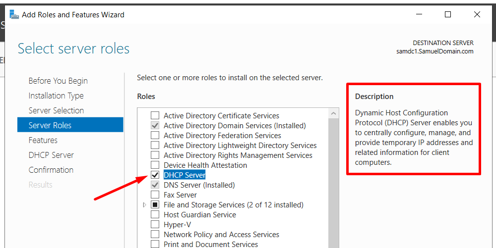

<p><sub><strong>Screenshot:</strong> DHCP Server role selection.</sub></p>

### Authorize DHCP in Active Directory

The DHCP server is authorized so it can issue leases in the AD domain environment. Authorization helps prevent an unmanaged DHCP server from silently handing out incorrect network settings inside the domain.

> In Active Directory environments, DHCP authorization is a protection mechanism against rogue DHCP servers. A rogue server can give clients the wrong gateway or DNS server, which can cause outages or enable traffic redirection.

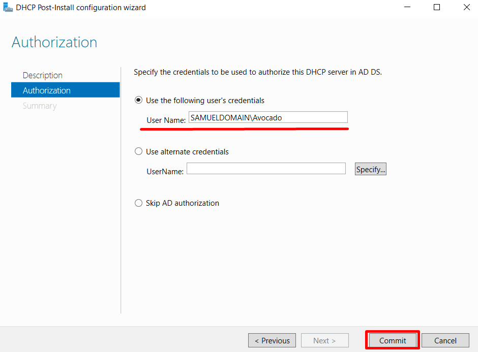

<p><sub><strong>Screenshot:</strong> DHCP authorization using domain credentials.</sub></p>

### Create the DHCP scope

The DHCP scope defines the client address range. This lab uses a controlled range inside the internal subnet.

> A scope tells DHCP which addresses it is allowed to lease. Defining a scope prevents random addressing and keeps client IP assignments inside the planned network range.

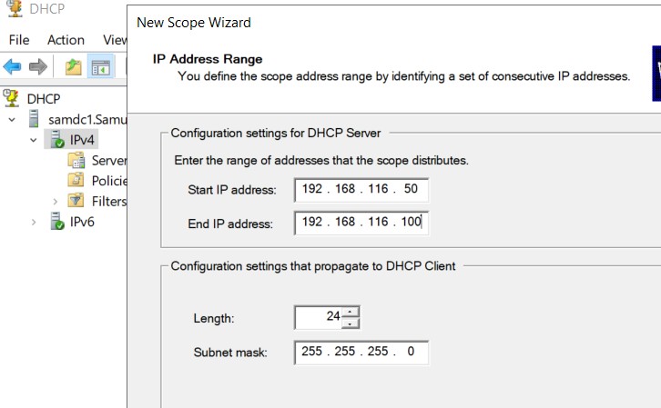

<p><sub><strong>Screenshot:</strong> DHCP scope address range configuration.</sub></p>

### Add exclusions

The first addresses in the range are excluded so they can remain reserved for static infrastructure or other planned use.

> Exclusions prevent DHCP from leasing addresses that should stay reserved for servers, routers, printers, or future infrastructure. This avoids IP conflicts between manually configured systems and DHCP clients.

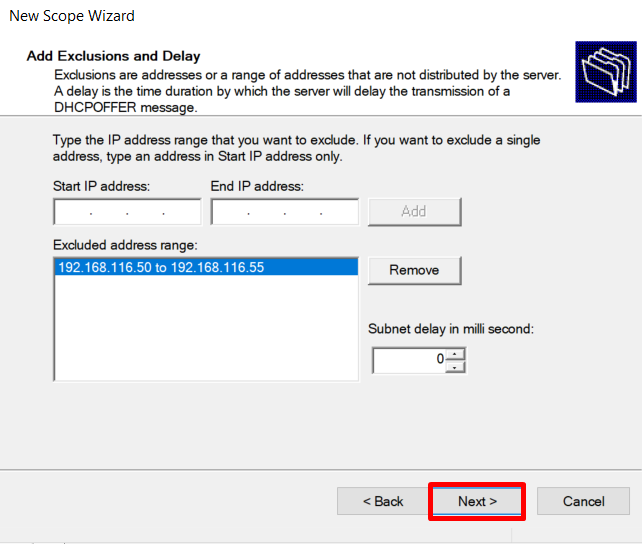

<p><sub><strong>Screenshot:</strong> DHCP exclusion range configuration.</sub></p>

### Configure DHCP options

The scope provides gateway and DNS settings to clients. The gateway points to SAMNAT and DNS points to the domain DNS servers.

> DHCP options are just as important as the IP address itself. The default gateway tells clients how to leave the subnet, and DNS options tell them where to resolve domain names and locate domain controllers.

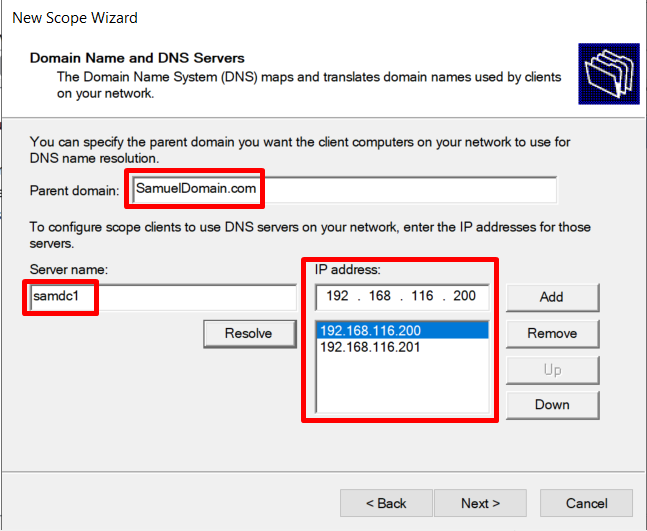

<p><sub><strong>Screenshot:</strong> DHCP DNS server option for domain clients.</sub></p>

### Validate automatic client configuration

The Windows 10 client receives its IP configuration automatically from DHCP. This validates the DHCP scope and options.

> Client validation proves that the DHCP server is not only configured, but actually usable from the endpoint side. It also confirms that the client receives the intended DNS and gateway values.

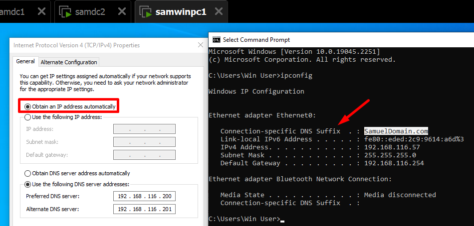

<p><sub><strong>Screenshot:</strong> Windows 10 receiving automatic DHCP address configuration.</sub></p>

### Configure DHCP failover

The lab configures a DHCP failover relationship with DC2. This is more accurately described as DHCP failover, not a failover cluster.

> DHCP failover lets two DHCP servers share responsibility for leases. If one server is unavailable, the other can continue leasing addresses, which improves availability for client network access.

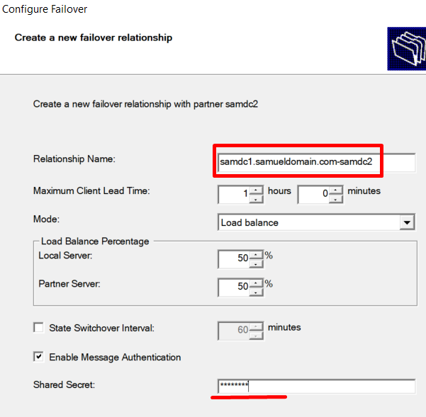

<p><sub><strong>Screenshot:</strong> DHCP failover relationship settings.</sub></p>

---------

## Remote Administration

Remote Desktop is enabled for the `Sys_Admins` group so administrators can manage servers from the Windows 10 workstation. The lab also demonstrates RDP access through a NAT forwarding rule.

Publishing RDP through NAT is treated here as lab-only evidence. In production, this should be replaced with VPN, RD Gateway, MFA, restricted source IPs, and explicit firewall rules.

This section is included because infrastructure administration is not only about installing services; administrators also need controlled, auditable ways to access servers. The lab validates both internal RDP access and an external-side forwarding scenario.

**Implemented controls:**

- Enabled Remote Desktop access for the administrator group.
- Validated RDP access from the Windows 10 workstation.
- Configured a lab-only NAT forwarding rule for RDP.
- Confirmed external-side RDP connectivity through SAMNAT.
- Documented production security considerations for exposed RDP.

### Enable RDP for administrators

The server is configured to allow RDP access for the administrative group.

> RDP allows administrators to manage servers remotely, but it should be limited to approved administrative users. Granting access through a group keeps the permission easier to review and remove.

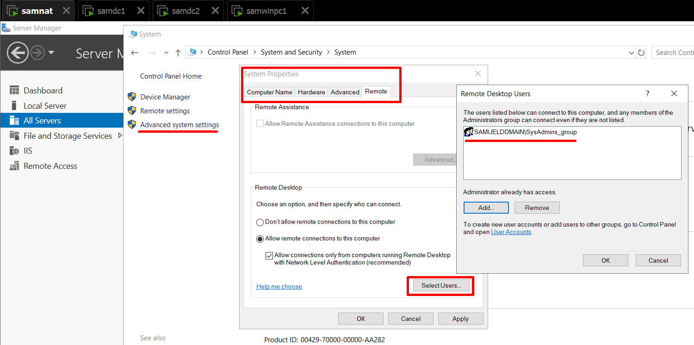

<p><sub><strong>Screenshot:</strong> Remote Desktop enabled for the Sys_Admins group.</sub></p>

### Validate RDP from the client

The Windows 10 client connects to a server through Remote Desktop using an authorized administrative user.

> Testing from the client side proves that firewall rules, group membership, credentials, and Remote Desktop settings all work together. It also confirms that access is usable for real administration, not only enabled in a settings window.

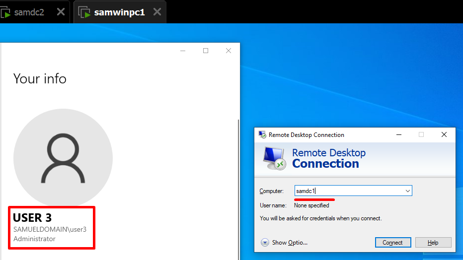

<p><sub><strong>Screenshot:</strong> RDP connection from Windows 10 as User 3.</sub></p>

### Configure NAT forwarding for RDP lab access

RRAS NAT is configured with a forwarding rule for RDP testing from the external side of the lab.

> Port forwarding maps traffic arriving on the NAT server to an internal machine. This is useful for a lab demonstration, but exposing RDP directly is risky in production because it increases brute-force and credential-attack exposure.

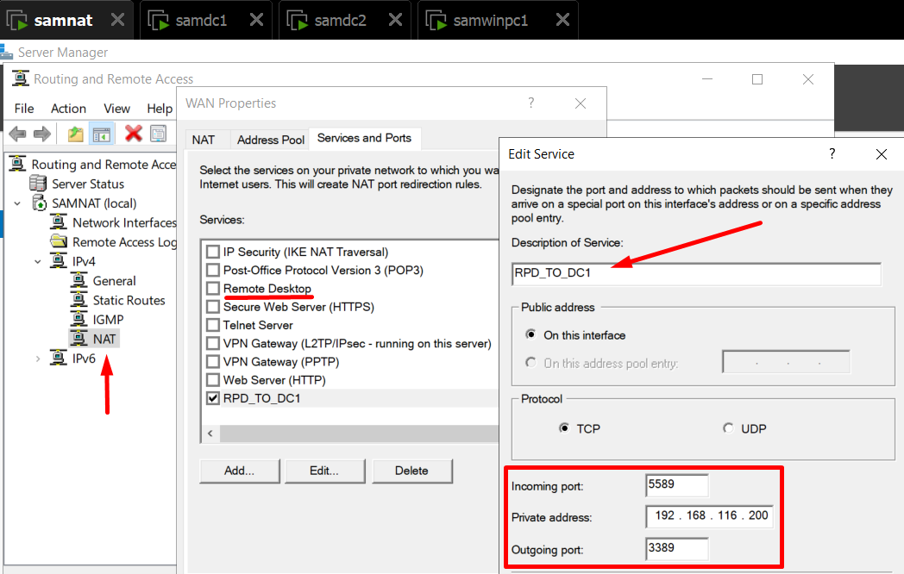

<p><sub><strong>Screenshot:</strong> NAT port forwarding rule for RDP lab access.</sub></p>

### Validate the forwarded RDP connection

The external RDP test confirms that the NAT forwarding rule works. This validates the lab concept, but it should not be treated as a production exposure model.

> The validation confirms that traffic reaches the correct internal target through SAMNAT. It also gives a clear place to discuss why production remote access should use safer controls such as VPN, RD Gateway, MFA, and source restrictions.

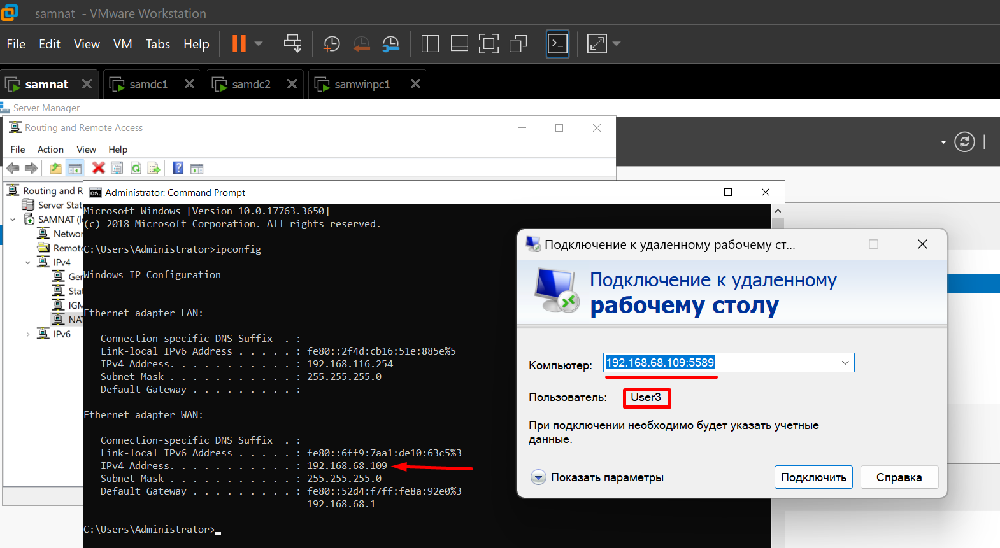

<p><sub><strong>Screenshot:</strong> External RDP validation through the forwarded lab port.</sub></p>

---------

## DNS Services and Name Resolution

DNS supports the domain and provides internal name resolution, external forwarding, controlled domain blocking, zone management, stub zones, and round robin behavior. In Active Directory, DNS is critical because clients use it to locate domain controllers and domain services.

This section demonstrates both internal DNS administration and external resolution behavior. The configuration includes forwarders, custom zones, conditional forwarding, a stub zone, secondary zone behavior, host records, and round robin testing.

DNS is treated here as both an infrastructure service and a security control. If DNS is wrong, domain logon, Kerberos, Group Policy, software deployment, and file access can all fail. If DNS is intentionally controlled, it can also be used to steer or block name resolution in a lab-safe way.

**Implemented controls:**

- Verified domain DNS settings on client and server systems.
- Configured external DNS forwarding.
- Created custom zones for controlled name-resolution behavior.
- Configured conditional forwarding and stub zone examples.
- Built primary and secondary zone behavior.
- Validated host records and round robin DNS responses.

### Confirm DNS client settings

Domain systems are configured to use the internal domain DNS servers. This is required for domain join, authentication, and service discovery.

> Active Directory depends on DNS service records. If a client uses an external DNS server instead of the domain DNS server, it may resolve internet names but still fail to find domain controllers, logon services, or Group Policy paths.

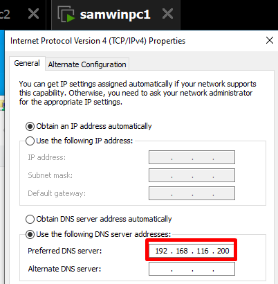

<p><sub><strong>Screenshot:</strong> Windows 10 DNS client settings pointing to the domain DNS server.</sub></p>

### Configure external DNS forwarding

External forwarding is configured so internal DNS servers can forward unresolved queries to an upstream DNS provider.

> Internal DNS should answer domain-related queries itself, but it still needs a path for internet names. A forwarder lets the domain DNS server keep control of internal resolution while sending unknown external queries to a trusted upstream resolver.

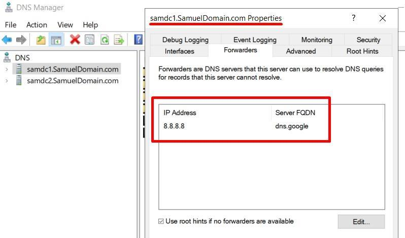

<p><sub><strong>Screenshot:</strong> DC1 external DNS forwarder configured for recursive resolution.</sub></p>

### Create a controlled zone for Facebook blocking

The lab creates a DNS zone for `facebook.com` and adds a controlled host record that prevents normal resolution. This demonstrates DNS-based name-resolution control in a lab context.

> DNS can be used to influence where clients go when they request a name. In this lab, a controlled zone demonstrates how name resolution can block or redirect access, which is useful for understanding both defensive filtering and the risk of malicious DNS manipulation.

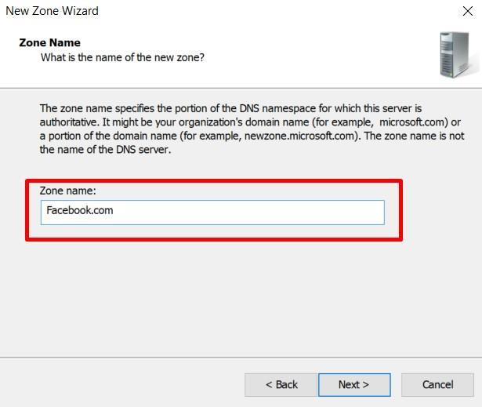

<p><sub><strong>Screenshot:</strong> Facebook.com zone name configuration.</sub></p>

### Validate the Facebook resolution result

The client validation shows that the configured DNS response prevents normal access to the target domain.

> A DNS control is only useful if the endpoint receives the expected answer. Testing from the client confirms that the DNS zone is actually affecting user traffic, not just existing in DNS Manager.

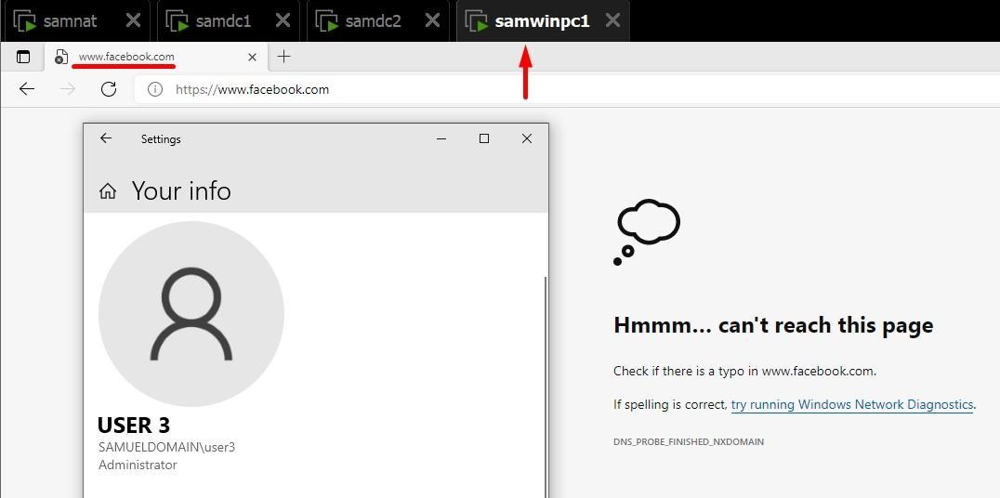

<p><sub><strong>Screenshot:</strong> Client validation showing blocked or unreachable Facebook resolution.</sub></p>

### Discover Google name servers

`nslookup` is used to identify Google DNS name server data before creating a conditional forwarder.

> `nslookup` is a basic troubleshooting tool for checking how names resolve and which name servers are responsible for a domain. Using it before configuration helps confirm the target DNS information instead of guessing.

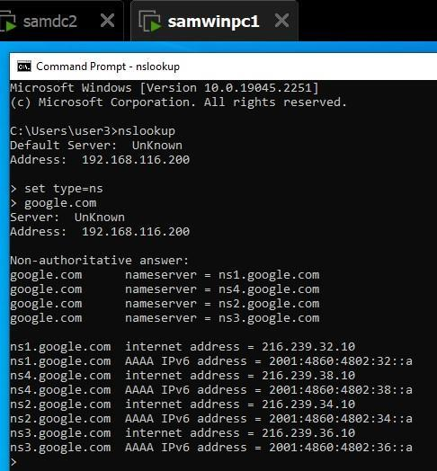

<p><sub><strong>Screenshot:</strong> `nslookup` output for Google DNS records.</sub></p>

### Configure a Google conditional forwarder

The conditional forwarder sends queries for `google.com` to a specific upstream server.

> A conditional forwarder is more specific than a general forwarder. It tells DNS to send queries for one domain to selected DNS servers, which is useful when different namespaces need different resolution paths.

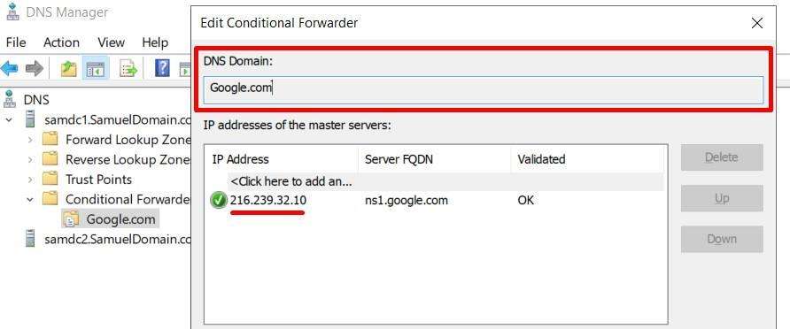

<p><sub><strong>Screenshot:</strong> Google conditional forwarder configured with a master server.</sub></p>

### Configure a Yahoo stub zone

A stub zone is configured using Yahoo name server information. Stub zones hold enough data to locate authoritative DNS servers for another zone.

> A stub zone does not contain the full zone data. It stores only the records needed to find the authoritative DNS servers, which makes it useful for learning how DNS delegation and authoritative resolution work.

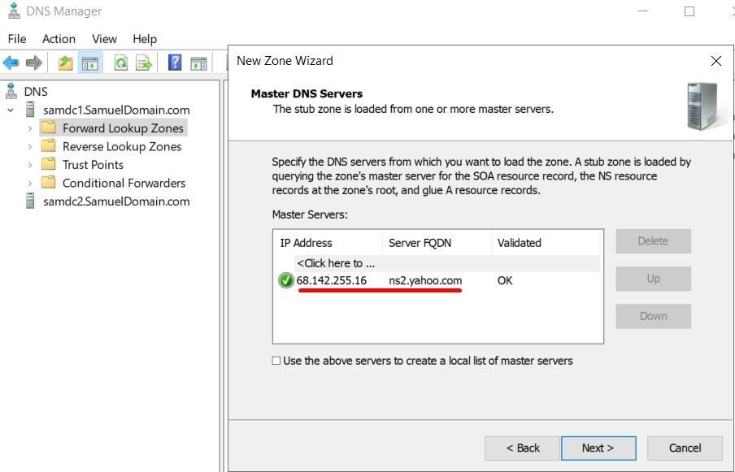

<p><sub><strong>Screenshot:</strong> Stub zone master servers for Yahoo.</sub></p>

### Create a secondary DNS zone

The lab creates a primary zone on DC1 and a secondary zone on DC2. The secondary zone receives data from the primary DNS server.

> A secondary zone is a read-only copy of a DNS zone transferred from a primary server. This improves availability for name resolution and demonstrates how DNS data can be replicated between DNS servers.

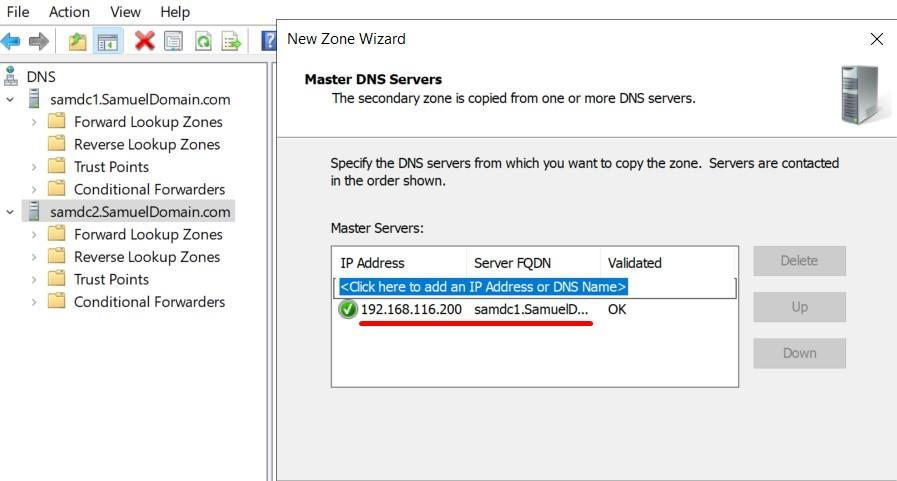

<p><sub><strong>Screenshot:</strong> Primary DNS server IP used for secondary zone transfer.</sub></p>

### Validate the mail host record

The source task described CNAME creation, but the evidence shows a host `A` record named `mail` pointing to `192.168.116.200`. A true CNAME would point an alias to an existing canonical hostname such as `samdc1.samueldomain.com`.

> An `A` record maps a name directly to an IP address, while a `CNAME` record maps an alias to another hostname. Documenting the difference keeps the project technically accurate and shows that DNS record types were reviewed, not copied blindly.

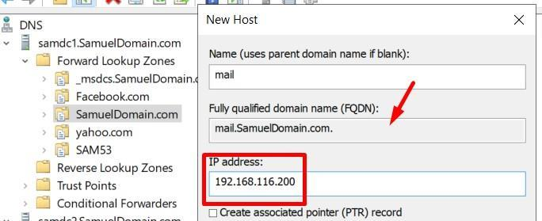

<p><sub><strong>Screenshot:</strong> Mail A record created for lab name-resolution validation.</sub></p>

### Validate DNS round robin

Multiple host records with the same name are used to demonstrate round robin behavior, where repeated queries can return different IP addresses.

> Round robin DNS is a simple way to distribute client requests across multiple IP addresses. It is not full load balancing, because it does not check server health, but it demonstrates how DNS can influence traffic distribution.

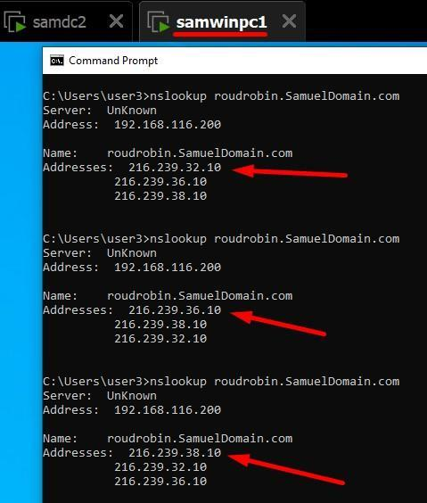

<p><sub><strong>Screenshot:</strong> Round robin validation showing changing returned addresses.</sub></p>

---------

## Roaming and Mandatory Profiles

Roaming profiles allow user profile data to follow the user across workstations. An AD user account represents identity and authentication, while a Windows user profile contains the user environment, settings, and profile data loaded during logon.

The goal of this section is to show centralized user-environment management. Roaming profiles support mobility between computers, while mandatory profiles enforce a consistent, non-persistent user environment.

**Implemented controls:**

- Created a centralized profile storage folder.
- Shared the profile location for domain access.
- Assigned the roaming profile path through AD user properties.
- Validated server-side profile folder creation after logon.
- Converted a roaming profile into a mandatory profile.

### Create the profile storage folder

A profile folder is created on DC1 to store roaming profile data centrally.

> Roaming profiles need a central network location where profile data can be saved and loaded. Without a shared storage location, the user profile remains tied to one workstation.

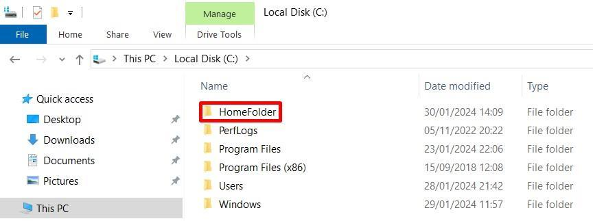

<p><sub><strong>Screenshot:</strong> Roaming profile root folder created on DC1.</sub></p>

### Configure profile share permissions

The folder is shared so users can access their roaming profile location through the network.

> The share makes the folder reachable over the network, while permissions control who can read or write profile data. Profile shares must be protected because they can contain user settings and personal application data.

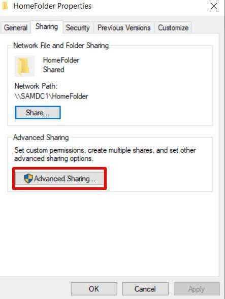

<p><sub><strong>Screenshot:</strong> Advanced sharing configuration for the profile folder.</sub></p>

### Assign the profile path in AD

The user object receives a profile path that points to the roaming profile share.

> Active Directory stores the profile path on the user object so Windows knows where to load and save that user's profile during logon and logoff. This connects identity management with the user's working environment.

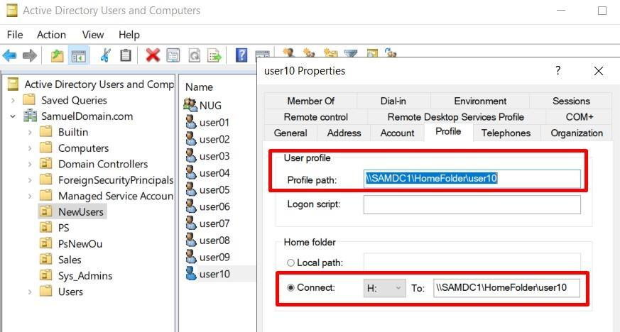

<p><sub><strong>Screenshot:</strong> Active Directory profile path configured for a user.</sub></p>

### Confirm profile folder creation

After the user signs in, the server-side profile folder is created automatically.

> This proves the profile configuration works from the user's session, not only from the administrator's settings. It confirms that Windows can create and use the central profile location.

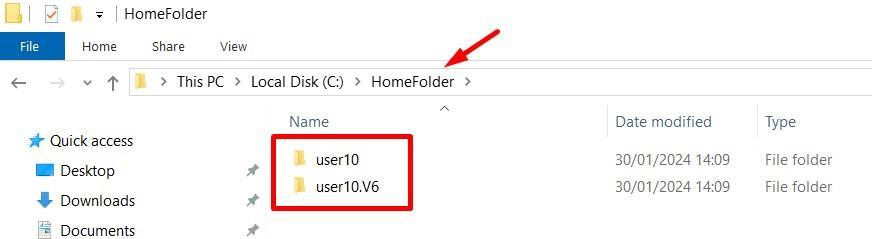

<p><sub><strong>Screenshot:</strong> User profile folders created after logon.</sub></p>

### Convert the profile to mandatory

The profile is converted to a mandatory profile by renaming `NTUSER.DAT` to `NTUSER.MAN`. This prevents user changes from persisting.

> `NTUSER.DAT` stores user-specific registry settings. Renaming it to `NTUSER.MAN` makes the profile mandatory, which means users receive a consistent environment and their changes are discarded after logoff.

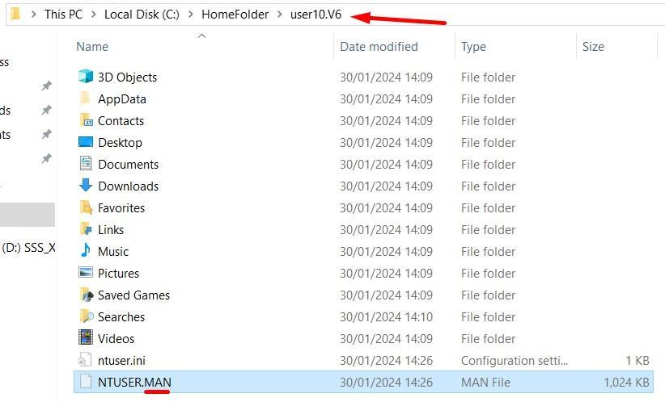

<p><sub><strong>Screenshot:</strong> `NTUSER.MAN` conversion for a mandatory profile.</sub></p>

---------

## File Services and Access Control

DC2 is configured as a file server. The lab creates home folders, a shared DATA folder, a script share, mapped drives, FSRM quotas, and file screening.

The purpose is to demonstrate how enterprise file access is controlled through layers: share permissions, NTFS permissions, AD groups, mapped drives, quota limits, and file-type restrictions. AD defines users and groups, while NTFS and FSRM enforce access and storage behavior on the file server.

**Implemented controls:**

- Installed the file server role on DC2.
- Created home folders and mapped them through AD.
- Configured group-based DATA share permissions.
- Validated allowed and denied user actions.
- Built a script-based drive mapping with `net use`.
- Enforced FSRM quota and AVI file-screening controls.

### Install the File Server role

DC2 is prepared to host file shares for domain users.

> A file server centralizes storage so users do not depend only on local workstation disks. It also allows administrators to enforce permissions, quotas, and file-type controls from one managed server.

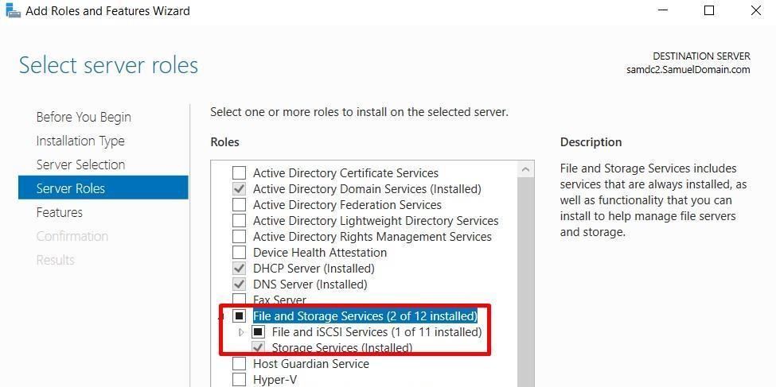

<p><sub><strong>Screenshot:</strong> File Server role selected on DC2.</sub></p>

### Create the home folder root

The home folder root is created and shared so each user can receive a personal mapped folder.

> Home folders give users a dedicated network location for personal files. Keeping them under one root folder makes permissions, backups, quotas, and administration easier to manage.

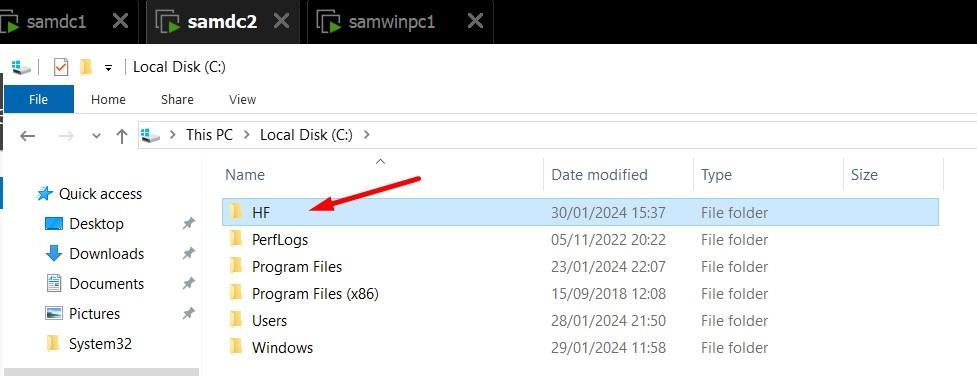

<p><sub><strong>Screenshot:</strong> Home folder root created on DC2.</sub></p>

### Map home folders through AD

The AD user properties are configured with a home folder path. Windows creates the user-specific folder when the mapping is applied.

> Mapping home folders through Active Directory keeps storage assignment tied to the user account. When the user signs in, Windows can automatically present the same home drive without manual mapping on each workstation.

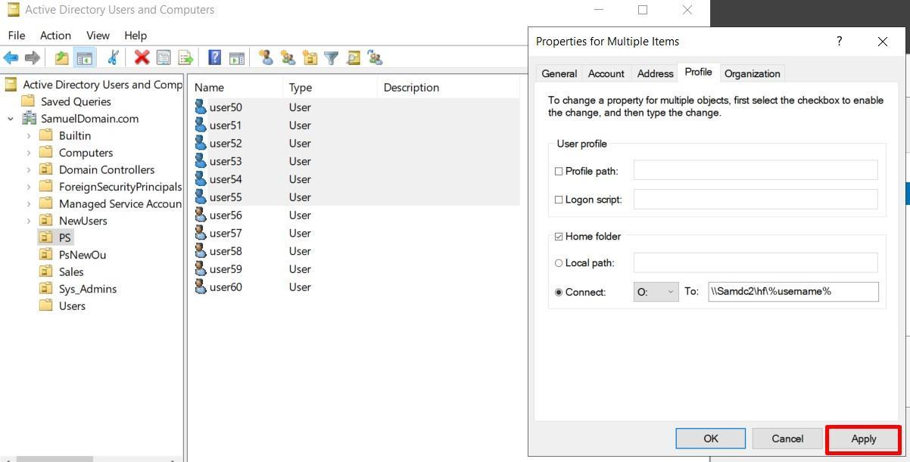

<p><sub><strong>Screenshot:</strong> Home folder mapping configured in AD user properties.</sub></p>

### Validate mapped home drives

The Windows 10 client shows the mapped home drive, confirming the user folder mapping worked.

> Validation from the client proves that the user can actually see and use the mapped drive. This checks AD settings, share access, network connectivity, and permissions together.

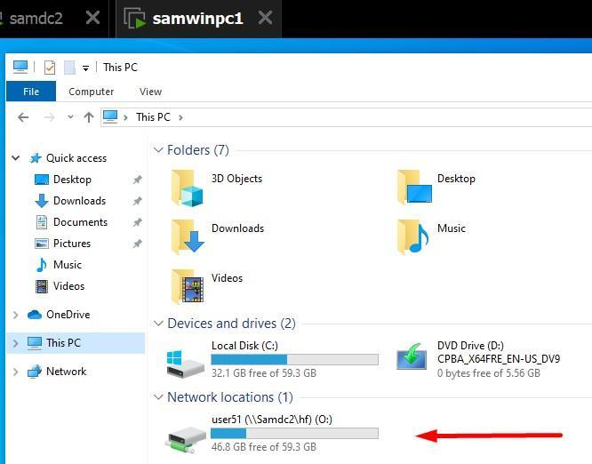

<p><sub><strong>Screenshot:</strong> Mapped home drive visible on the client.</sub></p>

### Configure DATA share permissions

The DATA share is configured with group-based permissions. `Sys_Admins` receive Modify permission, while Sales users receive Read and Execute.

The security goal is to avoid assigning access directly to individual users. Group-based access is easier to review, easier to remove, and safer when users move between roles.

> Share permissions and NTFS permissions work together. The effective access is the most restrictive result between them, so both layers must match the intended access model.

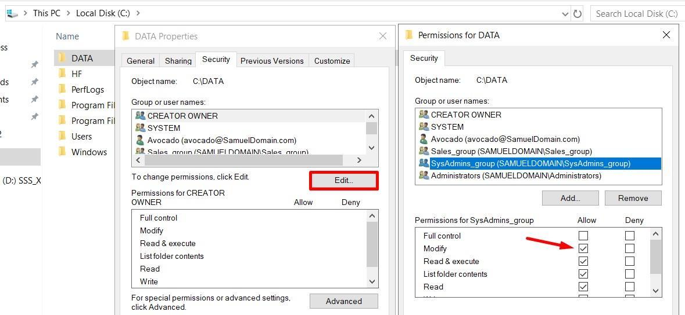

<p><sub><strong>Screenshot:</strong> Sys_Admins Modify permission on the DATA share.</sub></p>

### Validate restricted Sales permissions

The Sales user test confirms that the user can access the share but cannot delete files. This denied action is important validation: it proves that the permission boundary works, not only that access is possible.

> Access-control testing should include both allowed and blocked actions. A successful denial proves that least privilege is enforced and that the Sales role cannot perform administrative file operations.

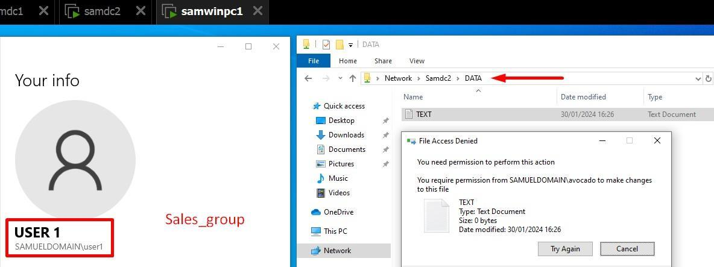

<p><sub><strong>Screenshot:</strong> Sales user denied delete operation.</sub></p>

### Create a script-based drive mapping

A batch script uses `net use` to map the DATA share as a network drive. This demonstrates a simple scripted access method.

> `net use` is a classic Windows command for mapping network drives. Even though Group Policy Preferences are often cleaner in production, this script shows how network resources can be connected automatically and repeatably.

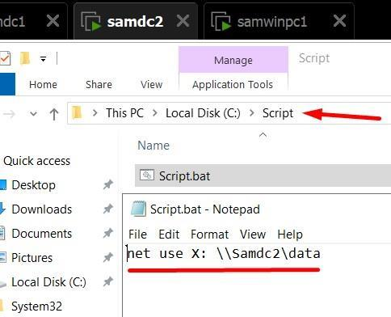

<p><sub><strong>Screenshot:</strong> Batch script using `net use` to map the DATA share.</sub></p>

### Configure a 5 GB hard quota

File Server Resource Manager is used to enforce a hard quota on home folders. This is an FSRM/file-server control, not an Active Directory quota.

> FSRM means File Server Resource Manager. A hard quota blocks users from exceeding the limit, which protects shared storage from uncontrolled growth and helps enforce storage policy.

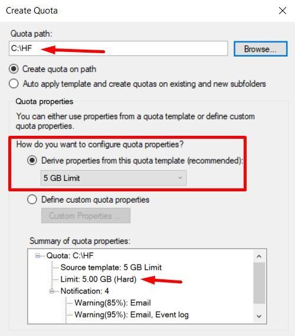

<p><sub><strong>Screenshot:</strong> Hard quota configured for a 5 GB limit.</sub></p>

### Configure AVI file screening

File screening is configured to block AVI files in the selected folder path. This controls file types separately from quota limits.

> File screening helps prevent unwanted file types from being stored on managed shares. In this lab, AVI blocking demonstrates storage governance and basic data-control policy, separate from who has access to the folder.

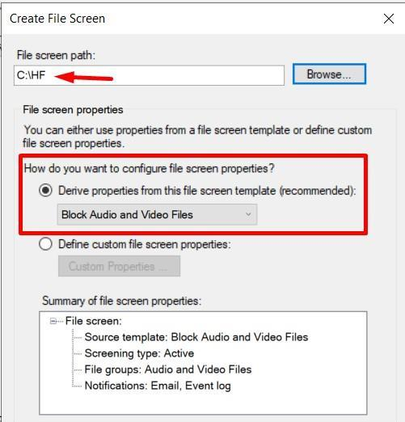

<p><sub><strong>Screenshot:</strong> AVI file screen settings.</sub></p>

---------

## Group Policy Hardening and Software Deployment

Group Policy is used to restrict standard users, allow exceptions for administrators, add `Sys_Admins` to local Administrators, and deploy software.

This section demonstrates centralized endpoint control. Instead of configuring each workstation manually, GPOs apply consistent restrictions and settings based on domain structure and security groups.

The hardening focus is to reduce the standard user's ability to change workstation behavior, launch administrative tools, or move data through removable media. Administrator exceptions are kept separate so support work remains possible without weakening the baseline for everyone.

**Implemented controls:**

- Created client-hardening GPOs.
- Restricted Command Prompt and Control Panel access for standard users.
- Blocked removable storage access.
- Configured administrator exceptions.
- Added `Sys_Admins` to local Administrators through policy.
- Deployed Notepad++ through GPO software installation.

### Open Group Policy Management

The Group Policy Management console provides centralized control for domain-linked policies.

> Group Policy Management is where administrators create, link, and review GPOs. A GPO, or Group Policy Object, is a collection of settings that can be applied to users or computers in the domain.

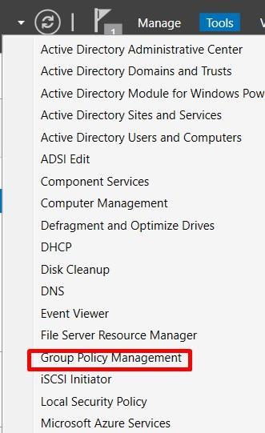

<p><sub><strong>Screenshot:</strong> Group Policy Management opened.</sub></p>

### Create a client-hardening GPO

A new GPO is created for client restrictions such as Command Prompt, Control Panel, and removable storage controls.

> A dedicated hardening GPO keeps security settings organized and easier to review. It also separates workstation restrictions from unrelated domain policies, which makes troubleshooting cleaner.

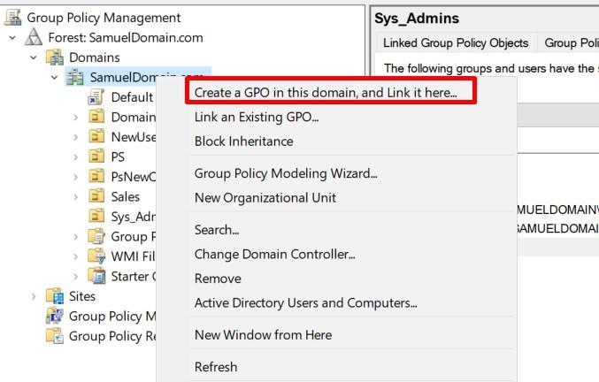

<p><sub><strong>Screenshot:</strong> Creating a new hardening GPO.</sub></p>

### Configure removable storage restrictions

The policy blocks removable storage access. This helps reduce data exfiltration and unauthorized removable media use.

> Removable media can be used to copy data out of the environment or introduce untrusted files. Blocking it through policy is a common endpoint-hardening control for standard users.

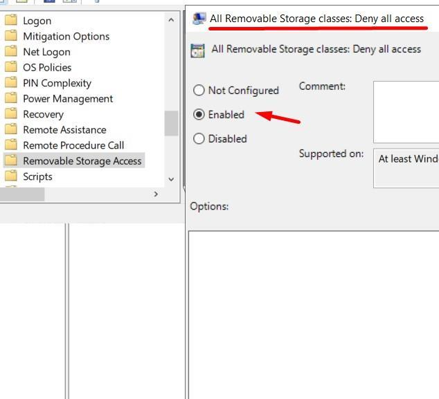

<p><sub><strong>Screenshot:</strong> Removable storage deny policy.</sub></p>

### Configure administrator exceptions

`Sys_Admins` receive an exception policy for administrative tools where required.

> Hardening should not block legitimate administration. Exceptions allow approved administrators to keep the tools they need while standard users remain restricted.

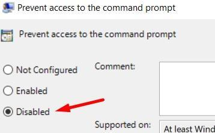

<p><sub><strong>Screenshot:</strong> Sys_Admins exception policy for Command Prompt.</sub></p>

### Add Sys_Admins to local Administrators

Restricted Groups are used to place `Sys_Admins` into local Administrators on domain workstations. This is powerful and should be scoped carefully in production.

> Restricted Groups can enforce local group membership from the domain. This is useful for consistent admin access, but it is also sensitive because local administrator rights can fully control a workstation.

> Security note: Local administrator membership should be limited, reviewed, and monitored. In production, this kind of access should be tied to least privilege and privileged-access procedures.

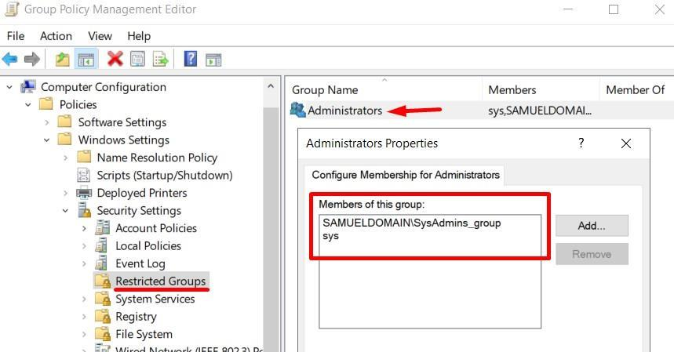

<p><sub><strong>Screenshot:</strong> Restricted Groups membership configuration.</sub></p>

### Validate standard-user restriction

The standard user is blocked from accessing Control Panel, confirming that the hardening policy applies.

> GPO settings are only valuable if they actually apply to the intended users and computers. This test confirms that standard users receive the restriction and cannot bypass the baseline through Control Panel.

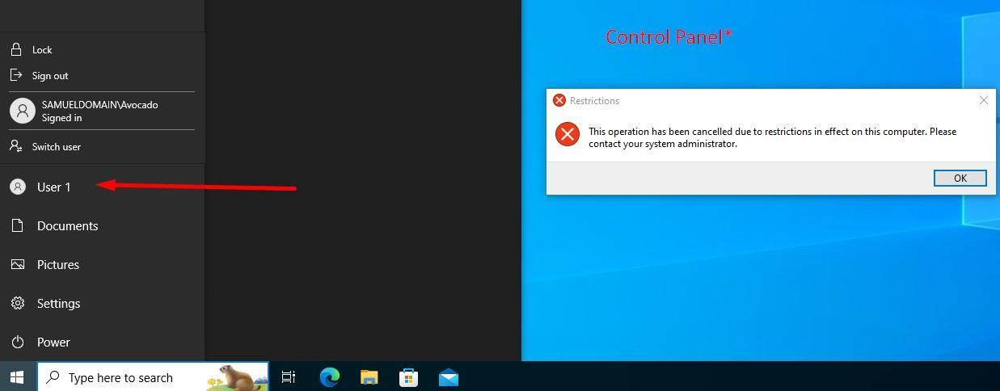

<p><sub><strong>Screenshot:</strong> Standard user blocked from Control Panel.</sub></p>

### Deploy software through GPO

The lab assigns a Notepad++ MSI package through Group Policy software installation.

> Software deployment through GPO allows administrators to distribute approved applications without manually installing them on every workstation. MSI packages are used because Group Policy software installation is designed around Windows Installer packages.

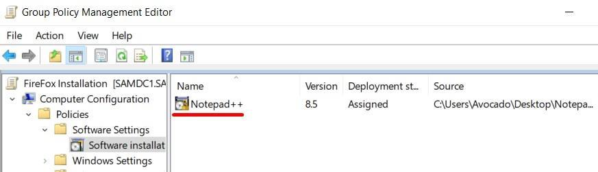

<p><sub><strong>Screenshot:</strong> Software installation package assigned through GPO.</sub></p>

### Validate software deployment

The Windows 10 client shows that Notepad++ deployment succeeded.

> Client validation proves that the package was reachable, assigned correctly, and installed on the workstation. This confirms the deployment path from GPO configuration to endpoint result.

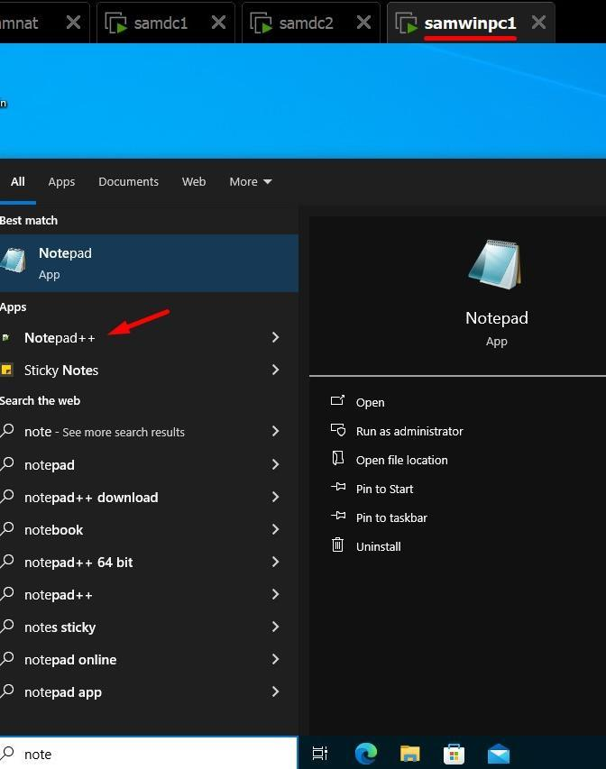

<p><sub><strong>Screenshot:</strong> Notepad++ deployment validation on Windows 10.</sub></p>

---------

## Password Policy and Account Security

The lab configures domain password controls and demonstrates a separate Sales password-policy scenario.

For production Active Directory environments, different password policies for different groups should normally be implemented with Fine-Grained Password Policies and Password Settings Objects rather than ordinary OU-linked GPO Account Policies.

The goal is to show how password policy contributes to account security by enforcing minimum password length, complexity, age, and history requirements. The Sales scenario is preserved as lab evidence while documenting the more accurate production approach.

Password policy is only one layer of account defense. It should support, not replace, account lockout policy, MFA, privileged account monitoring, and a clear process for handling compromised credentials.

**Implemented controls:**

- Configured domain password history and age requirements.
- Enforced minimum password length and complexity.
- Demonstrated a Sales-specific password policy scenario.
- Validated password-change behavior from the client side.
- Documented the production-correct Fine-Grained Password Policy approach.

### Configure the domain password policy

The policy defines password history, age, minimum length, and complexity requirements.

> Domain password policy sets the baseline rules for user credentials. Length, complexity, history, and age settings reduce weak password reuse and make simple password attacks harder.

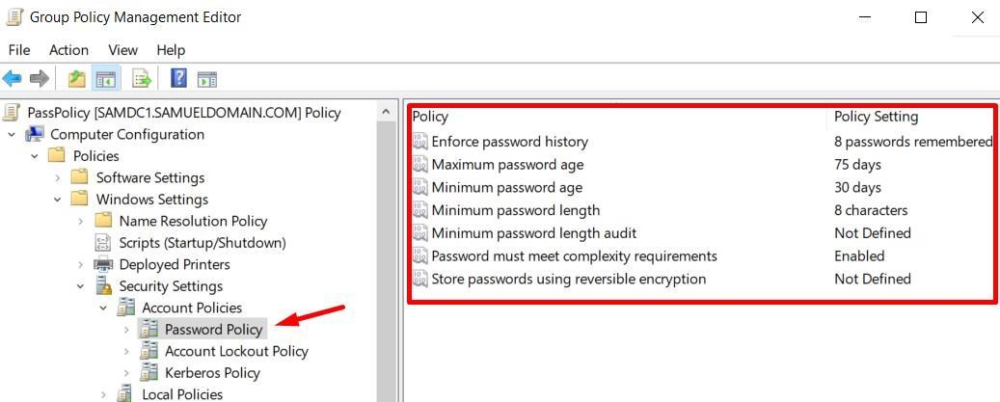

<p><sub><strong>Screenshot:</strong> Domain password policy settings.</sub></p>

### Demonstrate the Sales policy scenario

The lab demonstrates a different policy configuration for Sales. The README documents the production-correct approach while preserving the original evidence.

> In Active Directory, normal domain password policy applies at the domain level. If different groups need different password rules, the correct production method is Fine-Grained Password Policies using Password Settings Objects, not a regular OU-linked GPO Account Policy.

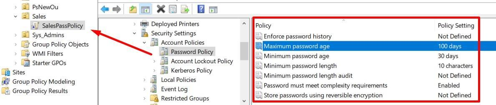

<p><sub><strong>Screenshot:</strong> Sales-specific password policy settings.</sub></p>

### Validate password-change behavior

The password-change screen confirms that the password policy scenario was tested from the client side.

> Testing password change behavior confirms that policy settings affect the real user workflow. It also shows whether the user is blocked or allowed according to the configured requirements.

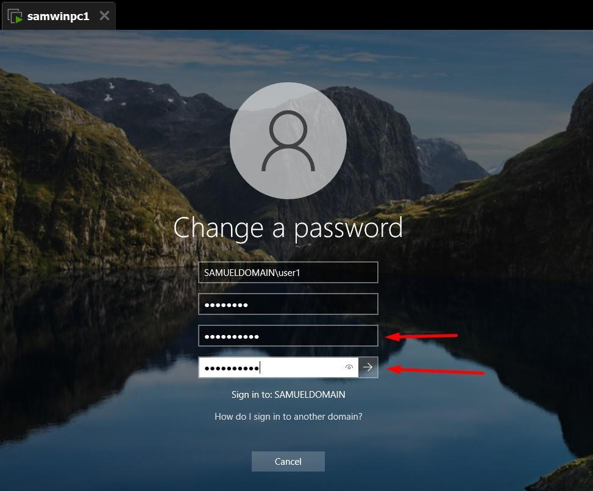

<p><sub><strong>Screenshot:</strong> Password change validation for the Sales policy demonstration.</sub></p>

## Testing and Verification

- Domain join was validated for Windows Server and Windows 10 systems.
- Active Directory object creation was validated in Active Directory Users and Computers.
- AD synchronization was validated by viewing created objects across both domain controllers.
- Internet connectivity was validated from internal systems through SAMNAT using ping tests.
- DHCP assignment was validated on the Windows 10 client with automatically assigned IP configuration.
- DHCP failover was configured with DC2 as the partner server.
- DNS forwarding and zone behavior were validated with `nslookup`, DNS Manager, and ping tests.
- RDP access was validated from the Windows 10 workstation and through a lab NAT forwarding rule.
- Roaming and mandatory profile behavior was validated through Windows user profile views and server-side profile folders.
- File share permissions were validated through successful and blocked user actions.
- FSRM quota and file screen controls were configured for storage governance.
- GPO hardening was validated by standard-user restrictions and Sys_Admins exception testing.
- Software deployment was validated by Notepad++ installation on the Windows 10 client.
- Password policy behavior was validated through Windows password-change workflow evidence.

## Results

The lab produced a working Windows domain infrastructure with redundant domain controller services, centralized DNS and DHCP, outbound NAT routing, domain-based remote administration, profile management, shared file services, GPO hardening, software deployment, and password policy controls.

Several source-level technical corrections were applied in this GitHub version to keep the documentation accurate while preserving the original lab evidence. Those corrections are documented in [docs/notes.md](docs/notes.md).

## Skills Demonstrated

- Windows Server administration
- Active Directory forest and domain deployment
- Domain controller promotion and replication validation
- FSMO role awareness
- User, group, and OU management
- PowerShell automation for AD object creation
- Legacy `dsadd` command usage
- RRAS NAT/PAT configuration
- DHCP scope and failover configuration
- DNS forwarding, zones, host records, stub zones, and round robin
- Remote administration with RDP
- Roaming and mandatory profile management
- NTFS and share permission design
- Mapped drive scripting
- File Server Resource Manager quotas and file screening
- Group Policy hardening
- GPO software deployment
- Password policy administration

## Repository Structure

```text
windows-server-active-directory-lab/
|-- README.md
|-- IMAGE_MANIFEST.md
|-- docs/
|   `-- notes.md
`-- images/
    |-- 01-topology/
    |-- 02-lab-environment/
    |-- 03-active-directory/
    |-- 04-nat-routing/
    |-- 05-dhcp/
    |-- 06-remote-management/
    |-- 07-dns/
    |-- 08-roaming-profiles/
    |-- 09-file-server/
    |-- 10-group-policy-hardening/
    `-- 11-password-policy/
```

## Notes

- Lab credentials and the lab domain remain visible in screenshots because they are part of the submitted lab evidence.
- The attached Excel file was intentionally excluded because it used a different domain and template context.
- RDP exposure through NAT is documented as a lab-only validation, not as a production recommendation.

## Suggested Commit Message

```text
Add professional GitHub documentation for Windows Server Active Directory lab
```
